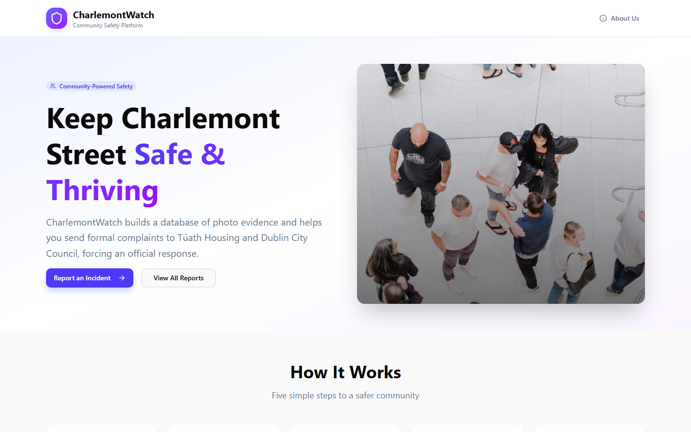
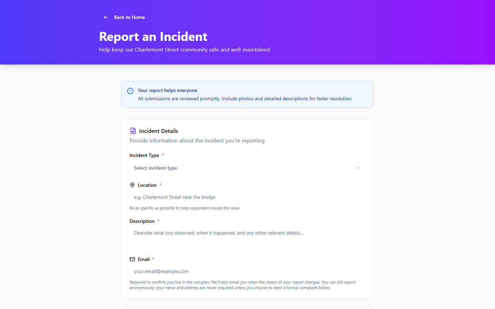
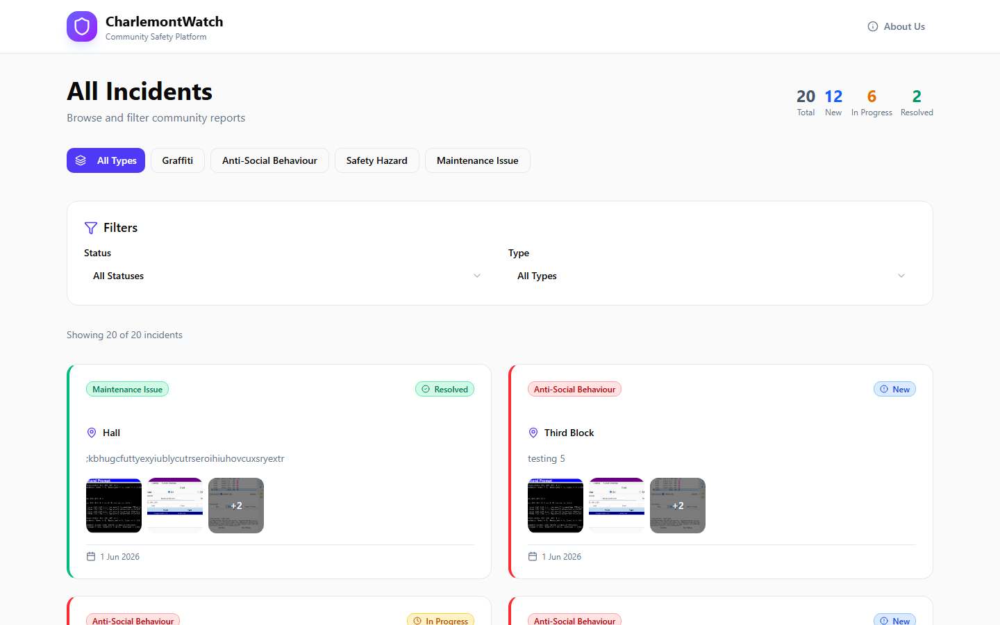
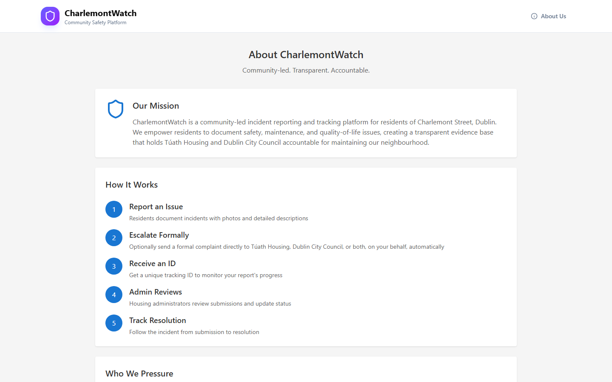

# CharlemontWatch

**Community-led incident reporting and tracking for Charlemont Street, Dublin.**

CharlemontWatch lets residents document safety, maintenance, and quality-of-life issues with photo evidence, track them through to resolution, and when a report alone isn't enough, send a formal complaint directly to Túath Housing and/or Dublin City Council on their own behalf.

[](https://github.com/DublinNico/CharlemontWatch/actions/workflows/ci.yml)

**Live:** [charlemontwatch-frontend.vercel.app](https://charlemontwatch-frontend.vercel.app) (frontend) · [charlemontwatch.onrender.com](https://charlemontwatch.onrender.com) (backend API) — custom domain `charlemontwatch.ie` pending DNS propagation



---

## Features

- **Report an incident** — Graffiti, Anti-Social Behaviour, Safety Hazards, and Maintenance Issues, each with type-specific detail fields
- **Photo evidence** — up to 10 photos per report, validated by real file content (not just declared MIME type) and automatically compressed before storage
- **Formal complaints** — optionally escalate a report directly to Túath Housing and/or Dublin City Council, with a formatted complaint email sent on the resident's behalf
- **Track by ID** — every report gets a unique `CW-XXXXXX` reference for status lookups, no account required
- **Satisfaction voting** — residents can publicly rate their satisfaction with Túath Housing (low/medium/high), one vote per email, changeable at any time
- **Admin dashboard** — JWT-authenticated review queue, photo moderation, and status updates (New → In Progress → Resolved)
- **Contact Us** — spam-protected general enquiry form for questions, feedback, or press, separate from the incident-report flow
- **Privacy by design** — GDPR-compliant privacy policy, no analytics or third-party tracking, defined data retention periods

## Screenshots

| Report an Incident | All Incidents |
|---|---|
|  |  |

| About |
|---|
|  |

## Tech Stack

- **Frontend** — React + Vite + TypeScript, React Router, Tailwind CSS, shadcn/ui (Radix UI primitives), Axios, Lucide icons

- **Backend** — Node.js + Express, MongoDB + Mongoose, JWT auth (bcryptjs), Multer + Sharp (photo upload + compression), AWS S3 (photo storage), Resend (email), Sentry (error monitoring), Helmet + express-rate-limit + express-mongo-sanitize (security hardening)

- **Deployment** — Vercel (frontend), Render (backend API), UptimeRobot (uptime monitoring + cold-start prevention)

- **Testing** — Jest + Supertest (backend), Vitest + React Testing Library (frontend), Playwright (E2E), Artillery (load testing) — 225 automated tests (172 backend + 38 frontend + 15 E2E) across unit, integration, security, and E2E suites

- **CI/CD** — GitHub Actions runs the full backend and frontend suites plus a frontend type check on every push to `dev` and PR to `main`, plus a daily encrypted `mongodump` backup workflow (GPG-encrypted before upload since the repo is public)

## Getting Started

### Prerequisites

- Node.js 18+
- A MongoDB database (local or [Atlas](https://www.mongodb.com/atlas))
- An AWS S3 bucket (for photo uploads)
- A [Resend](https://resend.com) account (for transactional email)

### 1. Clone and install

```bash
git clone https://github.com/DublinNico/CharlemontWatch.git
cd CharlemontWatch
cd backend && npm install
cd ../frontend && npm install
```

### 2. Configure environment variables

Copy the example files and fill in your own values:

```bash
cp backend/.env.example backend/.env
cp frontend/.env.example frontend/.env
```

See `backend/.env.example` and `frontend/.env.example` for the full list of variables (MongoDB URI, JWT secret, AWS S3 credentials, Resend API key, admin key, etc.).

### 3. Run the app

```bash
# Terminal 1 — backend (http://localhost:5000)
cd backend && npm run dev

# Terminal 2 — frontend (http://localhost:5173)
cd frontend && npm start
```

Visit `http://localhost:5173`.

## Testing

```bash
# Backend — unit, integration, and security tests + coverage
cd backend && npm test

# Frontend — unit tests
cd frontend && npm test

# Frontend — end-to-end tests (Playwright)
cd frontend && npm run test:e2e
```

## Documentation

- [`docs/PRE_LAUNCH_CHECKLIST.md`](docs/PRE_LAUNCH_CHECKLIST.md) — security, config, and deployment checklist (app has launched; kept for the few remaining post-launch items)
- [`docs/testing/TestingReport.md`](docs/testing/TestingReport.md) — full test plan, coverage, and execution results
- [`docs/use-cases/`](docs/use-cases) — use case documentation
- [`docs/bugs/`](docs/bugs) — resolved bug write-ups
