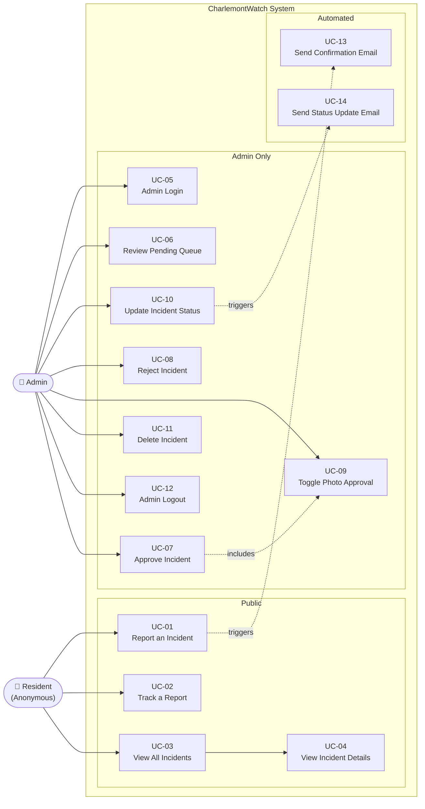
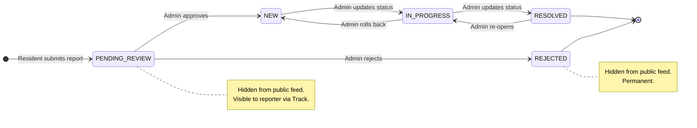
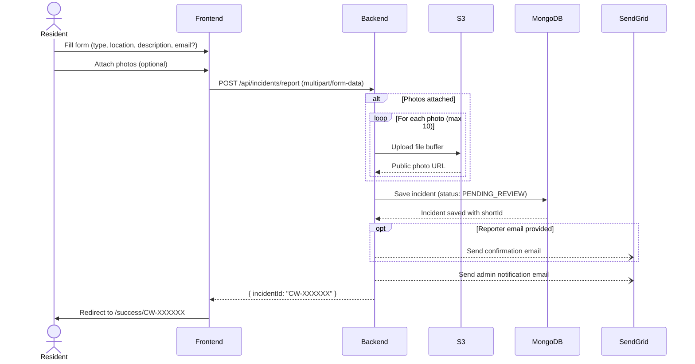
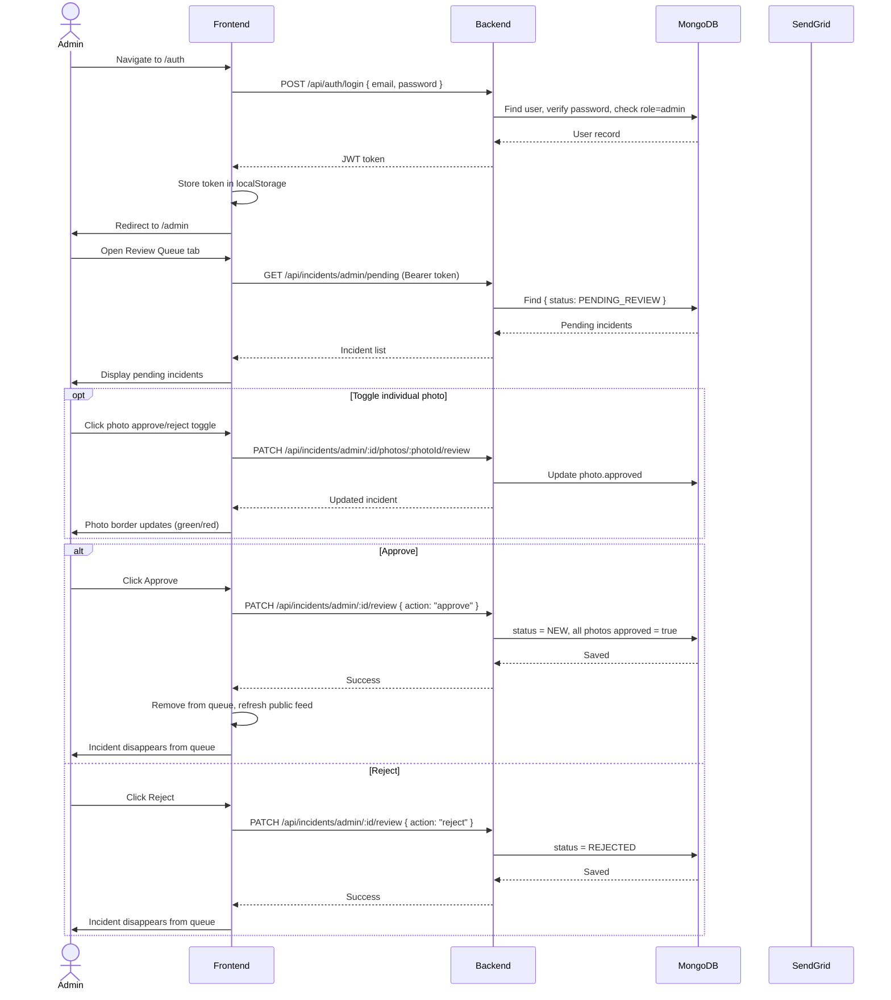
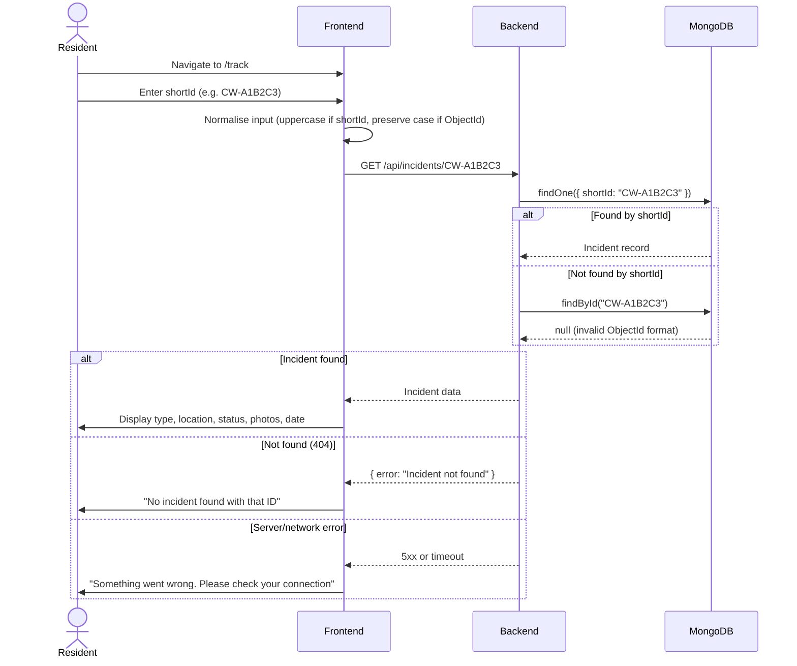
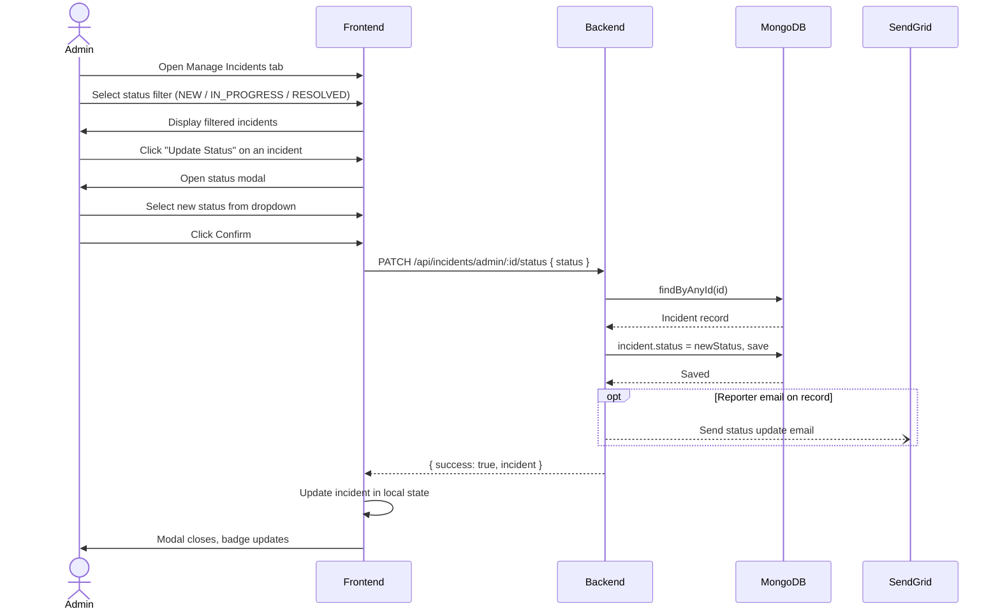
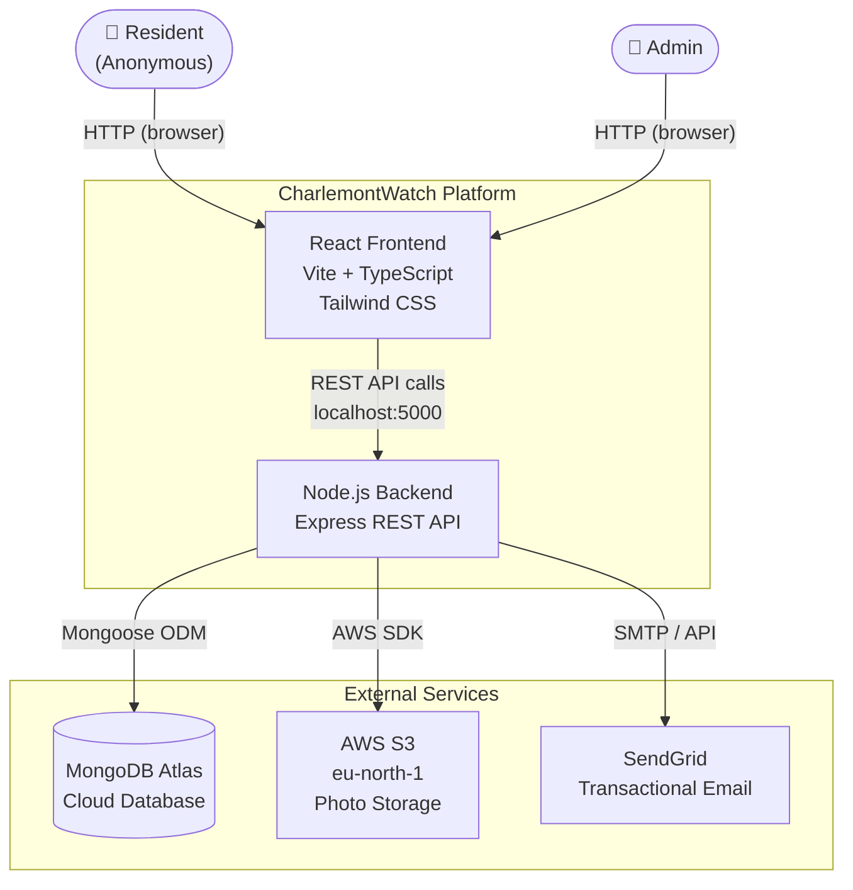

# CharlemontWatch — System Diagrams

All diagrams use [Mermaid](https://mermaid.js.org/) and render natively on GitHub.

---

## 1. Use Case Diagram

---

## 2. Incident Lifecycle — State Diagram

---

## 3. Sequence Diagram — Report an Incident (UC-01)

---

## 4. Sequence Diagram — Admin Review Flow (UC-05, UC-06, UC-07, UC-08, UC-09)

---

## 5. Sequence Diagram — Track a Report (UC-02)

---

## 6. Sequence Diagram — Update Incident Status (UC-10)

---

## 7. System Context Diagram

